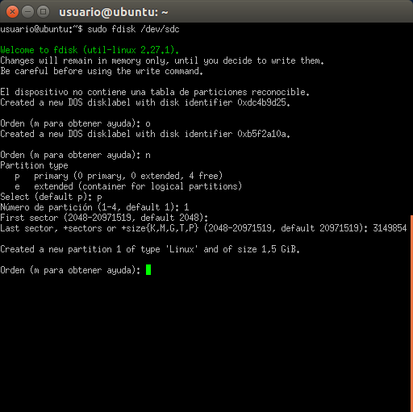

# Ejercicio de FSTAB y CRON

## FSTAB

### Configuración

* En primer lugar se comprueban los discos duros conectados al ordenador mediante `fdisk -l`.

#### Dando formato al primer disco

* Una vez hecho esto daremos formato al disco duro deseado mediante `fdisk` y el nombre del disco; en este caso será `fdisk /dev/sdb`. Una vez dentro insertamos `o` para crear la tabla de particiones.

* Tras esto pulsaremos `n` para crear una nueva partición. Siguientemente pulsaremos la `p` para indicar partición primaria, después el número de partición, en este caso el `1`, tras esto pulsamos la tecla `return` para que elija automáticamente el sector de inicio, y por último introducimos el tamaño deseado para la partición, empezando por el sector de inicio (yo introduge `2530000` como valor).

* Repetiremos para crear la segunda partición, pulsando de nuevo `n`, seguido de las opciones `p`, `2`, `return` y `return`.

* La partición 1 ya está en formato Linux (ext4), que es al que por defecto las particiones creadas son formateadas, pero la partición 2 ha de estar en formato **fat32**, por lo que pulsamos la tecla `t` para entrar a dar un formato específico a una partición, y pulsamos `2` para indicar que queremos realizarlo en la partición 2. Existen varios tipos de partición FAT32, elegiremos la `b`, **WIN95 FAT32**.

* Una vez terminado todo saldremos guardando de **fdisk** introduciendo `w`.

* Para terminar de formatear la primera partición usamos `mkfs.ext4 /dev/sdb1` para la primera partición.

* Y utilizamos `mkfs.fat /dev/sdb2` para la segunda partición.

* Tras haber completado todo comprobaremos que se han creado correctamente las particiones del disco mediante `fdisk -l`.

#### Dando formato al segundo disco

* Repetiremos con el segundo disco, introduciendo el nombre en el comando `fdisk` y el nombre del disco, en este caso `fdisk /dev/sdc`.

* Una vez aquí repetimos los pasos anteriores.

* Utilizamos `blkid -o list` como **root** para ver el **UUID** de las unidades conectadas, ya que lo necesitaremos en el siguiente paso.

* Una vez hemos apuntado los **UUID** de los discos particionados y creados, entramos en el archivo `/etc/fstab` con nuestro editor de texto preferido, y como **root**, para añadirlos al reconocimiento automático de discos de linux.

* Tras editar el archivo `fstab`, reiniciamos para que tomen efecto los cambios, y comprobamos con `blkid -o list` de nuevo, así veremos que ahora las particiones de **sdc** se automontan al iniciar.

* Para montar las unidades de **sdb** primero hay que crear los directorios en los cuales las montaremos; generalmente estos directorios están en la carpeta `/media`, así que crearemos con mkdir las carpetas `sdb1` y `sbd2` en `/media`. Una vez creadas montaremos los discos mediante `mount`, en nuestro caso `mount /dev/sdb1 /media/sdb1` y `mount /dev/sdb2 /media/sdb2`.

* Una vez montados, comprobamos con `blkid` si están correctamente montados, y con ello habremos terminado de crear y configurar las particiones correctamente.

## CRONTAB

### Pasos previos

* Para ejecutar la sincronía horaria, es necesario el programa ntp, por lo que lo descargamos mediante `apt install ntp`.

### Configuración

* Abriremos el archivo `/etc/crontab` con nuestro editor de texto favorito para configurar las tareas automáticas.

